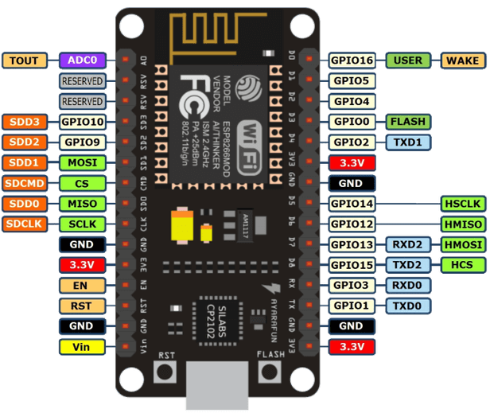

# Open_IOT
项目目的：打造最丰富的物联网控制系统

## ESP8266介绍

## 学习资料传送门
1. [教程 in Github](https://github.com/lvidarte/esp8266/wiki)
2. [ESP8266固件](http://micropython.org/download#esp8266)
3. [IDE](http://docs.dfrobot.com.cn/upycraft/)
4. [快速开发指南](https://micropython.nxez.com/2019/01/04/esp8266-quick-development-guide.html)
5. [官方参考文档](https://docs.micropython.org/en/latest/esp8266/quickref.html#pins-and-gpio)
6. [非官方中文参考文档](docs.dfrobot.com.cn/upycraft/3.2.2%20Pin.html)

